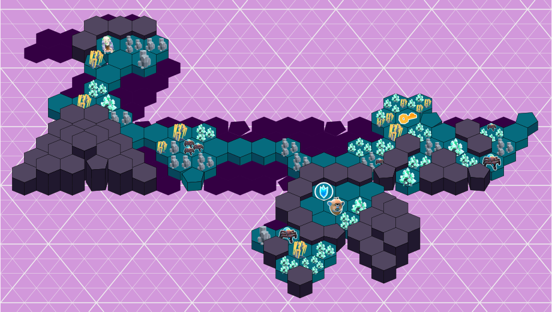

# MLU Maps

Editor for 2D maps for worlds based on
[Goldberg polyhedra](https://en.wikipedia.org/wiki/Goldberg_polyhedron), such as
[My Little Universe](https://say.games/games/my-little-universe/) by SayGames.

**[View Maps](https://sbliven.github.io/mlu_maps/)**

## How to read maps

MLU planets are Goldberg polyhedra, meaning they are composed of hexagons placed at the
vertices of a [geodesic sphere](https://en.wikipedia.org/wiki/Geodesic_polyhedron).
All planets have exactly 12 pentagons, located at the points of an icosohedron. Large
planets have seven hexagons between each pentagon, while small planets have three.

To form a map, the 3D shape is "unrolled" by adding gaps between tiles until it lies
flat. This is called a [net](https://en.wikipedia.org/wiki/Net_(polyhedron)) and can be
pictured like this:

*Image Credit: "Unfolding an icosahedron" by Rectas. Wikimedia Commons. CC0*

This means that all edges in the map will wrap around to join up somewhere else. Paths
in the world may cross gaps, and straight lines change direction when crossing an edge.
Where possible, edges have been chosen in oceans or mountains to make it easier to
navigate.

## Creating maps

Using the tool is described [here](usage.md). It describes how to change level contents
and styles. Contributions of official MLU maps are welcome! See
[Contributing](CONTRIBUTING.md) for more information.

## TODO

- [x] Basic hexagons and pentagon tiles
- [x] Show resources and enemies
- [ ] Advanced tiles
  - [ ] Bridges
  - [ ] Elevators
  - [ ] Decorative elements (paths, fires, rocket, etc)
  - [ ] Shops
- [ ] Levels
  - [ ] Gaia
  - [ ] Trollheim
  - [ ] Dimidium
    - [x] Diamond Mine
  - [ ] Factorium
  - [ ] Wadirum
  - [ ] Odysseum
  - [ ] Dragonora
  - [ ] Egyptium
  - [ ] Asium

## License

Copyright Spencer Bliven and released under the GPL 3.0 or later license.

Game artwork copyright SayGames.
